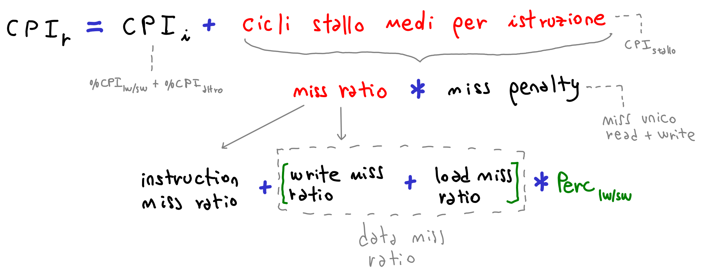

# tutorato-architettura-elaboratori

Materiali per il tutorato del corso di architettura degli elaboratori dell'università Ca' Foscari di Venezia. I materiali sono stati ereditati da Tommaso Moretto e rielaborati con aggiunte e cambiamenti.

Potete trovare [qui](https://www.youtube.com/playlist?list=PLTlGUQDkR92-QWZ3HltyuGYVwUytT3_hK) anche la playlist Youtube online sviluppata durante il periodo di lockdown 2020 per covid19. 

Enjoy!

